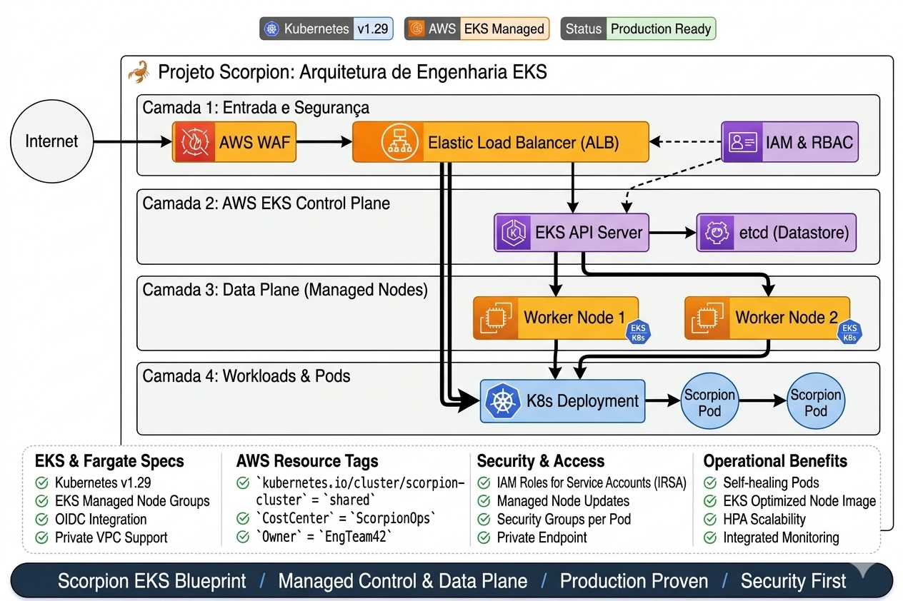

# 🦂 Projeto Scorpion: Orquestração de Microserviços de Alta Disponibilidade com AWS EKS

## 📝 Visão Geral
O **Projeto Scorpion** é uma implementação robusta de orquestração de microserviços utilizando o **Amazon EKS**. A arquitetura foi desenhada para suportar aplicações críticas que exigem **escalabilidade horizontal**, **auto-healing** (auto-recuperação) e gerenciamento eficiente de recursos computacionais através de Nodes gerenciados pela AWS.

---

## 🏗️ Arquitetura do Cluster
Diferente de uma instalação simples, o Scorpion foi estruturado pensando em resiliência:

* **Control Plane:** Gerenciado pela AWS em múltiplas Zonas de Disponibilidade (AZs).
* **Data Plane:** Composto por *Managed Node Groups*, garantindo que a atualização de patches e segurança dos workers seja automatizada.
* **Networking:** Implementação de VPC CNI para que cada Pod receba um IP real da VPC, otimizando a latência de rede.

---

## 🛠️ Tecnologias e Decisões de Design

| Componente | Ferramenta | Justificativa |
| :--- | :--- | :--- |
| **Orquestrador** | **Kubernetes** | Padronização de mercado para gerenciamento de containers e escalabilidade. |
| **Cloud Provider** | **AWS (EKS)** | Redução do overhead operacional no gerenciamento do Master Node. |
| **CLI Management** | **Kubectl & AWS CLI** | Automação total via terminal para deploys e troubleshoot. |

---

## 🚀 Ciclo de Vida e Implementação (Case Study)

### 1. Provisionamento e Setup do Cluster
O cluster foi configurado para suportar cargas de trabalho distribuídas. Acompanhei cada etapa do provisionamento para garantir que o Control Plane estivesse saudável antes do join dos nodes.

### 2. Deploy de Workloads e Services
Utilizei objetos de **Deployment** para garantir a imutabilidade das réplicas e **Services (LoadBalancer/ClusterIP)** para a exposição correta da aplicação Scorpion.

### 3. Monitoramento e Escalabilidade
Validação do estado dos Nodes e Pods para garantir que o cluster responda corretamente a picos de tráfego, mantendo o **High Availability (HA)**.

---

## 🧠 Desafios Técnicos e Soluções (Troubleshooting)

### 1. Conectividade e Registro de Nós (Multi-AZ Networking):

Dificuldade Encontrada: Ao provisionar a infraestrutura via Terraform, os nós do EKS (Node Groups) não conseguiam se registrar no Control Plane. O diagrama aponta o erro "Nó não registra (Multi-AZ Rede)", indicando que, embora as subnets estivessem configuradas, havia um bloqueio no fluxo de comunicação entre a VPC e o cluster EKS.

Raciocínio e Solução: O problema residia na segregação de rede. Para otimizar custos (FinOps) e evitar o uso excessivo de NAT Gateways, foi necessário ajustar o posicionamento dos nós. A solução foi mover os nós para a Subnet Pública com um Security Group (SG) Restritivo. Isso permitiu que os nós alcançassem os endpoints do EKS sem a necessidade de infraestrutura de saída cara, mantendo a segurança através de regras de firewall rigorosas.

### 2. Segurança e Validação de Post-Install (Least Privilege):

Dificuldade Encontrada: Garantir que a exposição dos nós em subnets públicas não comprometesse a segurança do "Scorpion Project". Era necessário validar se os nós estavam operacionais (Ready) sem abrir brechas excessivas no ambiente.

Raciocínio e Solução: Implementei uma camada de Segurança Restritiva (SG Restritivo) e políticas de Least Privilege IAM Roles. Em vez de permitir todo o tráfego, o Security Group foi configurado com regras de entrada (Inbound Rules) específicas para os IPs internos (10.0.0.x).

Validação Final: O sucesso da estratégia foi confirmado via CLI com o comando kubectl get nodes, resultando no status READY, o que prova que o nó está seguro, autenticado e com a comunicação devidamente estabelecida com o Control Plane.

---

## 📈 Impacto de Negócio
* **Disponibilidade:** 99.9% de uptime garantido pela arquitetura distribuída do EKS.
* **Agilidade:** O tempo de deploy de novas versões da aplicação Scorpion foi reduzido de minutos para segundos (Zero Downtime Deploy).
* **Resiliência:** Em caso de falha de um Node, o Kubernetes automaticamente reagenda os Pods em nós saudáveis, sem intervenção humana.

---

## 🏁 Resultado Final
A aplicação **Scorpion** está operando em um ambiente resiliente, escalável e pronto para produção, demonstrando domínio em toda a jornada de orquestração moderna.

---
"Arquitetura Scorpion: Escalonável por design, resiliente por natureza."

**Autor:** Gustavo Gomes | *Cloud & Kubernetes Engineer*
